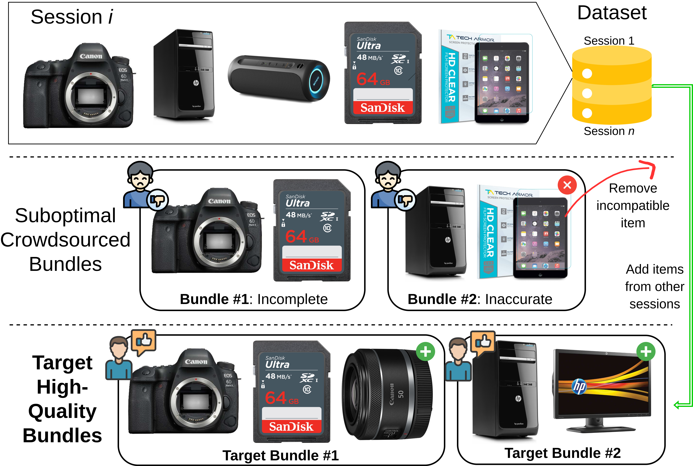
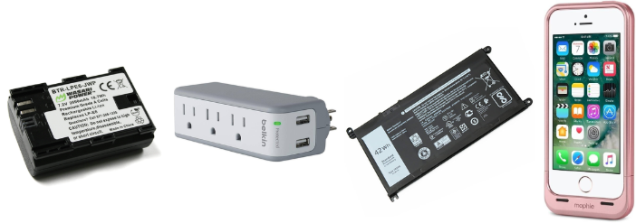

# LLM4BEAR 🐻

> I like bears.

Welcome to the **LLM4BEAR** repository. **L**arge **L**anguage **M**odels for **B**undle **E**valu**A**tion and **R**efinement. This project focuses on enhancing the crowdsourced BundleRec dataset using Large Language Models (LLMs) through a multi-stage pipeline. 



---

# 🛠 Project Structure & Usage

All core logic and experimentation reside in the **Jupyter Notebooks** located within the `Code/` folder. 

* **Anonymous Repository:** Even !git clone commands have been replaced by this anonymous author. I have done all within my power to fulfill requirements.
* **Full LLM4BEAR Pipeline:** A streamlined pipeline has been provided.
* **Standalone Execution:** Each notebook for each step of our process is designed to run independently.
* **LLM Outputs Saved:** To ensure accessibility and reproducibility, all LLM outputs required by the code have been pre-generated and provided as resources on the front page of this repository. The notebooks are downloadable and your own API key can be added to Google Colab for ease of use in order to cross-check our process.

# Full LLM4BEAR Pipeline [[View Pipeline](Code/Full_LLM4BEAR_Pipeline)] (API Key Required)

The data is bundled in, so you don't have to `git clone` the whole repo — just grab the
`Full_LLM4BEAR_Pipeline` subfolder on its own:

```bash
git clone --depth 1 --filter=blob:none --sparse https://github.com/anon5159753/LLM4BEAR.git
cd LLM4BEAR
git sparse-checkout set "Code/Full_LLM4BEAR_Pipeline"
cd "Code/Full_LLM4BEAR_Pipeline"
```

Then set up and run (remove mock for full iteration run):

```bash
python -m venv venv
./venv/bin/pip install -r requirements.txt

./venv/bin/python stage1_egpo.py          --mock
./venv/bin/python stage2_best_prompts.py  --mock
./venv/bin/python stage3_refinement.py    --mock
./venv/bin/python stage4_make_dataset.py
```

Note: Stage 1 may still take ~30 minutes even under mock conditions.

---

# LLM4BEAR Framework

.png)


# 🔄 Core Processes

The project is divided into six distinct stages, each corresponding to a specific notebook/process:-
- **0. LLM4BEAR Framework:** Annotating Bundles
- **1. LLM4BEAR Framework:** EGPO 
- **2. LLM4BEAR Framework:** Bundle Refinement
- **3. Validation:** Human Evaluation
- **4. Validation:** Downstream Bundle Generation (not part of LLM4BEAR framework)
- **5. Non-LLM-Baselines:** Bundle Generation for original BundleRec dataset as LLM4BEAR lacks user-data interaction data.
- **6. LLM4BEAR Dataset Construction**

## 0. Annotating Bundles - [[View Code](Code/0_Annotating%20Bundles)] (API Key Not Required)
The initial phase where bundles and their constituent items have had their images manually downloaded from Google Images. This was done to ensure rigorous quality of the annotated bundles. Anyone can access and review the bundles annotated for this paper as well as the bundle score and bundle annotations provided. This code provides the basis of deriving the ground-truth for the EGPO mechanism.

Link to show the bundles that were annotated: https://github.com/anon5159753/Bundle_Annotating

### Crowdsourced Electronic Bundle Example ([Annotated Bundles.ipynb)](Code/0_Annotating%20Bundles/Annotating_Bundles.ipynb)


**Bundle Intent: Batteries**

**Items:**
- Wasabi Power Battery for Canon LP-E6 and Canon EOS 5D Mark II, EOS 5D Mark III, EOS 6D, EOS 7D, EOS 60D, EOS 60Da, EOS 70D
- Belkin 3-Outlet Mini Travel Swivel Charger Surge Protector with Dual USB Ports, 5 Charging Outlets Total (1 AMP / 5 Watt)
- Laptop/Notebook Battery for Dell Inspiron
- Mophie Juice Pack Air Battery Case for iPhone 5 and 5S
  
**Expert Annotation:** The bundle lacks functionality integration as there is no clear way to connect all the items coherently. The Wasabi Power Battery implies the user has a camera, the Battery for Dell Inspiron requires that specific laptop, and the iPhone case implies the user has an iPhone 5. The items are not similar at all, and do not complement each other. The diversity of the bundle only adds confusion.

**Expert Score: 1/5**

### 📊 Expert Annotation & Dataset Statistics

The **LLM4BEAR** project utilises a high-quality, expert-labelled subset of bundles to drive the **Expert-Guided Prompt Optimisation (EGPO)** mechanism.

To audit the quality of crowdsourced bundles, we tasked experienced item bundling researchers to annotate a representative subset of the BundleRec dataset as experts. Adhering to a structured evaluation protocol, these experts provided both written explanations of an annotated bundle’s thematic and functional synergy, alongside a score out of 5.

### 0.a. Annotation Scale & Meaning
Experts evaluated bundles using a 5-point scale based on the relationship between items and the overall purchase viability.

| Score | Meaning |
| :--- | :--- |
| **1-2** | **Low-quality**: No or weak relations between bundle items. |
| **3** | **Needs improvement**: One or two modifications are needed. |
| **4-5** | **High-quality**: A reasonable bundle to purchase. |

### 0.b. Expert Score Distribution
The table below details the distribution of these scores across our three domains, highlighting the volume of labelled data and the resulting average quality.

| Domain | Labelled Bundles | 1 | 2 | 3 | 4 | 5 | Avg. Score |
| :--- | :---: | :---: | :---: | :---: | :---: | :---: | :---: |
| **Electronic** | 137 | 34 | 28 | 26 | 14 | 35 | 2.91 |
| **Clothing** | 151 | 8 | 28 | 30 | 26 | 59 | 3.66 |
| **Food** | 150 | 21 | 23 | 34 | 30 | 42 | 3.30 |

In particular, the Electronic domain has a higher quantity of poorly constructed bundles.


## 1. Expert-Guided Prompt Optimisation (EGPO) - [[View Code and Optimised Prompts](Code/1_EGPO)] (API Key Required for Verification)
A specialised framework for refining an LLM's ability to evaluate bundle quality accurately. It uses bundle score and annotations provided by ``experts'' to iteratively refine for prompts which enable an LLM to become an accurate bundle quality evaluator. This process ends up incorporating expert-guided knowledge of bundling nuances into the automated LLM-powered bundle evaluation process.


### 1.a. EGPO Mechanism Splits
For the iterative refinement of LLM prompts, we organised the top 50 bundles per domain for training, featuring the most detailed qualitative analyses. The remaining labelled data is partitioned for validation and testing to ensure the EGPO mechanism is robust across the board.

| Domain | Training | Validation | Test | Total |
| :--- | :---: | :---: | :---: | :---: |
| **Electronic** | 50 | 22 | 65 | 137 |
| **Clothing** | 50 | 30 | 80 | 150 |
| **Food** | 50 | 30 | 81 | 151 |


---

## 2. Bundle Refinement – [[View Code and Refinement Components](Code/2_Bundle%20Refinement)] (API Key Required for Verification)
This process focuses on refining detected non-high-quality bundles. The EGPO-derived evaluation module provides detailed feedback and a refinement direction to remove low-quality items and add relevant items to complete an incomplete bundle. This is done to refine non-high-quality bundles into high-quality bundles.

 ```mermaid

graph TD
    %% Node Definitions
    Start((Bundle)) --> Eval[Evaluation Module]
    Eval --> Decision{Score ≥ 4?}
    
    %% Success Path
    Decision -- "Yes" --> Success((High-quality Bundle))
    
    %% Refinement Path
    Decision -- "No" --> Summary[Summary Module]
    Summary --> Action{Select Operation}
    
    Action -- "Inaccurate" --> Remove[Remove Module]
    Action -- "Incomplete" --> Add[Add Module]
    
    %% Loop back to Evaluation
    Remove --> Eval
    Add --> Eval

    %% Professional Palette
    classDef gate fill:#eef2ff,stroke:#6366f1,stroke-width:2px,color:#312e81;
    classDef brain fill:#f5f3ff,stroke:#8b5cf6,stroke-width:2px,color:#2e1065;
    classDef node fill:#ffffff,stroke:#9ca3af,stroke-width:1px,color:#374151;
    classDef terminal fill:#f9fafb,stroke:#374151,stroke-width:2px,color:#111827;
    
    class Eval,Decision gate;
    class Summary,Action brain;
    class Remove,Add node;
    class Start,Success terminal;

``` 

### 2.a. Ablation Study: BundleRec vs. LLM4BEAR

Based on the provided screenshots and data, here is the comparative analysis of the BundleRec and LLM4BEAR datasets. The statistics highlight a significant shift in percentage of high-quality bundles ($\bar{s}/c$HQ % given by Evaluation Module/Claude), average score ($\bar{s}$) and bundle size between the original BundleRec dataset and the LLM4BEAR-refined version. $N_{eff}$ represents the effective catalogue utilisation. Although LLM4BEAR datasets are higher in quality, there is a noticeable drop of in effectively utilised items in the dataset, limiting item discovery.

We evaluate the efficacy of the LLM4BEAR framework based on its ability to satisfy the dual objectives of item bundling. First, the refined dataset must contain high-quality bundles to appeal to consumers, as quantified by the average score $\bar{s}$ from the EGPO-derived Evaluation Module. Second, it must promote item discovery and introduce consumers to products they might not otherwise have considered. A refinement process that excludes lower priority items—such as tripods or lighting equipment—may yield higher average quality scores by adhering to popular item pairs; however, it simultaneously stifles potential revenue generated by enhanced item discovery. Thus, we also report the effective catalogue utilisation ($N_{eff}=2^H$), which measures the breadth of items offered within the refined dataset. Here, $H = -\sum_{i=1}^Mp_i \log_2p_i$ represents the item entropy, where $p_i$ denotes the frequency of item $i$ across all bundles relative to the total number of item occurrences. While $M$ represents the total number of items available in the domain, $N_{eff}$ quantifies the effective number of items actively utilised within the dataset. $cs$ for Claude score is also given as an independent LLM evaluator. Claude-3-5-haiku was used for an independent LLM evaluator throughout this project.

| Dataset | Domain | $\bar{s}$ | $\bar{s}$HQ % | $cs$ | $c$HQ % | $N$_eff | Avg. Bundle Size |
| :--- | :--- | :---: | :---: | :---: | :---: | :---: | :---: |
| **BundleRec** | Electronic | 2.98 | 24.29 | 3.44 | 47.09 | 2803 | 3.52 |
| | Clothing | 3.35 | 41.47 | 3.36 | 45.08 | 4110 | 3.31 |
| | Food | 3.12 | 25.73 | 3.73 | 61.04 | 3163 | 3.58 |
| **LLM4BEAR** | Electronic | <u>4.62</u> | <u>95.60</u> | 4.38 | 87.54 | <u>1775</u> | 2.80 |
| | Clothing | **4.43** | **94.76** | 3.85 | **64.66** | <u>3152</u> | <u>2.66</u> |
| | Food | **4.57** | **98.49** | **4.43** | **93.16** | <u>2290</u> | <u>3.23</u> |
| _w/o item retrieval_ | Electronic | 4.15 | 67.43 | 3.88 | 67.14 | **2072** | 2.55 |
| | Clothing | 4.19 | 80.26 | 3.65 | 57.07 | **3295** | 2.57 |
| | Food | 4.18 | 74.55 | 4.14 | 79.76 | **2535** | 2.86 |
| _w/o session data_ | Electronic | **4.64** | **96.57** | **4.39** | **88.11** | 1716 | <u>2.81</u> |
| | Clothing | <u>4.40</u> | <u>93.46</u> | **3.86** | 64.55 | 2996 | 2.64 |
| | Food | **4.57** | <u>98.43</u> | 4.42 | 92.26 | 2233 | 3.21 |
| _w/o eval. feedback_ | Electronic | 3.70 | 38.97 | 4.17 | 78.97 | 1285 | **9.75** |
| | Clothing | 3.81 | 53.04 | 3.66 | 56.60 | 2404 | **8.11** |
| | Food | 3.74 | 39.46 | 4.12 | 78.36 | 1628 | **9.76** |


An ablation study was conducted to verify the necessity of each component within the LLM4BEAR framework. To evaluate the significance of co-purchased session data, the **Add Module**'s retrieval capabilities, and the **Evaluation Module**'s feedback, we compare **BundleRec** and **LLM4BEAR** against three variants. The _w/o item retrieval_ variant lacks the ability to retrieve items from the dataset, restricting the candidate pool to only the original session items. Conversely, _w/o session data_ ignores the original session items, relying solely on the LLM's internal logic to retrieve relevant items. Finally, the _w/o eval. feedback_ variant maintains retrieval and session components but disables qualitative feedback from the **Evaluation Module**. In the absence of a refinement direction (revised intent), this variant employs fixed heuristic principles to refine a bundle, such as adding an item whenever the bundle fails to fulfil the original bundle intent.


The BundleRec dataset exhibits a sharp breadth-quality trade-off: while it possesses a high effective catalogue utilisation across domains, its density of high-quality bundles is low (24-41%). In contrast, LLM4BEAR and the _w/o session data_ variant leverage item retrieval to achieve a high-quality completion rate above 90%. The similar rates are likely attributable to bundle refienement algorithm, which terminates refinement once the high-quality threshold is met. However, the inclusion of session data in LLM4BEAR yields a superior $N_{eff}$ compared to the _w/o session data_ variant, enhancing item discovery while maintaining high-quality standards.

Failure to incorporate key refinement components leads to distinct failure modes. The _w/o item retrieval_ variant achieves only a 67--81% high-quality completion rate. Its ostensibly higher $N_{eff}$ is a passive byproduct of refinement failure, where the model is forced to retain noisy session items because viable alternative items could not be retrieved. In contrast, the _w/o eval. feedback_ variant continuously adds redundant items until termination (avg. bundle size > 8), resulting in low-quality, oversized bundles with a collapsed $N_{eff}$.

Interestingly, both $\bar{s}$ and $cs$ produce consistent relative rankings across datasets—with **LLM4BEAR** and the _w/o session data_ variant emerging as top performers—except in their assessment of the _w/o eval. feedback variant_. Unlike the proposed Evaluation Module, Claude does not penalise excessive bundle sizes, leading to a significant score disparity. Furthermore, a global misalignment is observed: while the GPT-based, expert-aligned Evaluation Module maintains calibration across domains, Claude consistently rates Clothing bundles below a 4.0. This suggests a domain-specific bias in the base Claude LLM that the calibrated Evaluation Module successfully mitigates.

Overall, **LLM4BEAR** exhibits the best balance of high-quality bundle completion rate while balancing effective catalogue utilisation (maximising diversity of items in the bundle dataset).

## 3. Human Evaluation – [[View Code](Code/3_Human%20Evaluation)] [[View Surveys](3_Human%20Evaluation)] [[View Code](Code/3_Human%20Evaluation/Case_Study.ipynb)] (API Key Not Required)
This details the process in which we designed our surveys to provide to willing human participants. First, while we manually scanned Google Images to annotate the representative subset of bundles for annotations, doing so for ~10000 images would be too tedious and time-consuming. Thus, we used a Google Search API key in order to scrape images off the internet. While some images are less accurate, the bundle survey instructions for participants explicitly detailed that discrepancies between item titles and images could be present, and to focus more on the item titles. Links to sample surveys have been provided, with the highlighted surveys that have already been completed being closed. No names for participants have been disclosed.


### 3.a. Quality Improvement Summary
The table below summarises the average quality score improvements across all domains. Our refinement pipeline achieved a consistent lift in perceived bundle quality, with particularly strong gains in the Electronic and Clothing sectors.

| Domain | Average BundleRec Score | Average LLM4BEAR Score | $\Delta$ Score | $\Delta$% |
| :--- | :---: | :---: | :---: | :---: |
| **Electronic** | 3.06 | 3.56 | +0.50 | +16.3% |
| **Clothing** | 2.96 | 3.46 | +0.50 | +16.7% |
| **Food** | 3.28 | 3.46 | +0.18 | +5.7% |

### 3.b. Comparative Results (Before vs. After Refinement)
The following tables demonstrate the delta ($\Delta$) in quality scores across our three domains following the refinement process. Our results indicate a significant migration from low-quality scores (1-2) to high-quality scores (4-5).

#### **Electronic Domain ($n=660$ bundles)**
| Score | BundleRec | LLM4BEAR | $\Delta$ Count | $\Delta$% |
| :--- | :---: | :---: | :---: | :---: |
| 1 | 75 | 31 | -44 | -58.7% |
| 2 | 136 | 84 | -52 | -38.2% |
| 3 | 214 | 174 | -40 | -18.7% |
| 4 | 144 | 227 | +83 | +57.6% |
| 5 | 91 | 144 | +53 | +58.2% |

#### **Clothing Domain ($n=560$ bundles)**
| Score | BundleRec | LLM4BEAR | $\Delta$ Count | $\Delta$% |
| :--- | :---: | :---: | :---: | :---: |
| 1 | 73 | 28 | -45 | -61.6% |
| 2 | 125 | 84 | -41 | -32.8% |
| 3 | 164 | 160 | -4 | -2.4% |
| 4 | 145 | 179 | +34 | +23.4% |
| 5 | 53 | 109 | +56 | +105.7% |

#### **Food Domain ($n=520$ bundles)**
| Score | BundleRec | LLM4BEAR | $\Delta$ Count | $\Delta$% |
| :--- | :---: | :---: | :---: | :---: |
| 1 | 10 | 15 | +5 | +50.0% |
| 2 | 119 | 72 | -47 | -39.5% |
| 3 | 175 | 170 | -5 | -2.9% |
| 4 | 150 | 184 | +34 | +22.7% |
| 5 | 66 | 79 | +13 | +19.7% |


## 4. Bundle Generation – [[View Code](Code/4_Bundle%20Generation)] (API Key Required)
The proof of concept for the value of our LLM4BEAR framework. We have done Zero/Few-shot for multiple LLMs: gemini-2.0-flash-001, claude-3-5-haiku, llama-3.3-70b-instruct, and mistral-small-24b-instruct-2501. In addition we have applied Adaptive In-Context Learning (AICL) and Supervised Finetuning (SFT) as baselines. Zero-shot demonstrates that the expanded LLM4BEAR sessions, required as the simulated user sessions must also include the added items from other sessions, increases the capacity of LLMs to generate high-quality bundles. Beyond item availability, we introduce Greedy Jaccard Similarity in order to filter high-quality training examples generated by the LLMs above for both datasets. Our SFT results demonstrate that an unrefined dataset can lead to minimal or degrade bundle generation performance for GPT-4o-mini and GPT-4.1-mini respectively.
Link to AICL: [[https://github.com/BundleRec/bundle_generation](https://github.com/BundleRec/bundle_generation)]


### 4.a. Session Splits for bundle Generation

One shot bundle generation is a when we task an LLM to organising co-purchased items from a single user session into one or more bundles. Bundles are generated in "one shot" and thus, there is no adding or removing items post generation. The session splits are as follows.

| Domain | Training | Validation | Test | Total | 
| :--- | :---: | :---: | :---: | :---: |
| Electronic | 623 | 90 | 180 | 893 | 
| Clothing | 698 | 90 | 180 | 968 |
| Food | 644 | 90 | 180 | 914 |

For the following tables, **P** is Precision, **R** is Recall, **GJS** is Greedy Jaccard Similarity and **$\bar{s}$** is the score of the bundle given by the LLM-based evaluation moduel.

### 4.b. Baselines using GPT-4o-mini

| Dataset | Baseline | Electronic | | | | Clothing | | | | Food | | | |
| :--- | :--- | :---: | :---: | :---: | :---: | :---: | :---: | :---: | :---: | :---: | :---: | :---: | :---: |
| | | **P** | **R** | **GJS** | **$\bar{s}$** | **P** | **R** | **GJS** | **$\bar{s}$** | **P** | **R** | **GJS** | **$\bar{s}$** |
| **BundleRec** | Zero-shot | 0.428 | 0.400 | 0.558 | 3.208 | 0.534 | 0.525 | 0.668 | 3.692 | 0.419 | <u>0.469</u> | 0.611 | 3.564 |
| | Few-shot | <u>0.443</u> | <u>0.409</u> | 0.561 | 3.255 | <u>0.574</u> | <u>0.549</u> | **0.686** | <u>3.755</u> | <u>0.441</u> | 0.442 | 0.628 | 3.594 |
| | AICL | 0.424 | 0.384 | <u>0.567</u> | <u>3.355</u> | 0.550 | 0.542 | <u>0.682</u> | **3.772** | 0.410 | 0.420 | <u>0.616</u> | <u>3.663</u> |
| | SFT | **0.480** | **0.440** | **0.591** | **3.406** | **0.591** | **0.582** | 0.668 | <u>3.755</u> | **0.479** | **0.508** | **0.634** | **3.701** |
| --- | --- | --- | --- | --- | --- | --- | --- | --- | --- | --- | --- | --- | --- |
| **LLM4BEAR** | Zero-shot | 0.313 | 0.324 | 0.513 | 3.322 | 0.455 | 0.494 | 0.633 | 3.851 | 0.335 | 0.412 | 0.551 | 3.708 |
| | Few-shot | 0.320 | 0.328 | 0.544 | 3.521 | **0.492** | **0.524** | <u>0.637</u> | 3.844 | 0.342 | 0.375 | 0.566 | 3.757 |
| | AICL | **0.380** | **0.412** | <u>0.573</u> | <u>3.575</u> | 0.442 | 0.485 | 0.627 | <u>3.876</u> | <u>0.379</u> | <u>0.422</u> | **0.605** | **3.854** |
| | SFT | <u>0.359</u> | <u>0.366</u> | **0.574** | **3.805** | <u>0.477</u> | <u>0.495</u> | **0.652** | **3.963** | **0.391** | **0.436** | 0.601 | 3.853 |

### 4.c. Baselines using GPT-4.1-mini

| Dataset | Baseline | Electronic | | | | Clothing | | | | Food | | | |
| :--- | :--- | :---: | :---: | :---: | :---: | :---: | :---: | :---: | :---: | :---: | :---: | :---: | :---: |
| | | **P** | **R** | **GJS** | **$\bar{s}$** | **P** | **R** | **GJS** | **$\bar{s}$** | **P** | **R** | **GJS** | **$\bar{s}$** |
| **BundleRec** | Zero-shot | 0.422 | 0.369 | 0.577 | 3.609 | 0.595 | 0.552 | 0.689 | 4.037 | 0.463 | 0.450 | 0.619 | 3.805 |
| | Few-shot | 0.439 | 0.396 | 0.594 | 3.601 | 0.646 | 0.592 | 0.717 | 3.982 | 0.474 | 0.448 | 0.628 | 3.824 |
| | AICL | 0.426 | 0.351 | 0.564 | 3.634 | 0.571 | 0.505 | 0.686 | 4.004 | 0.448 | 0.423 | 0.614 | 3.874 |
| | SFT | 0.485 | 0.441 | 0.581 | 3.483 | 0.596 | 0.550 | 0.683 | 3.789 | 0.449 | 0.448 | 0.603 | 3.668 |
| --- | --- | --- | --- | --- | --- | --- | --- | --- | --- | --- | --- | --- | --- |
| **LLM4BEAR** | Zero-shot | 0.370 | 0.415 | 0.561 | 3.847 | 0.487 | 0.526 | 0.641 | 4.052 | 0.348 | 0.412 | 0.570 | 4.002 |
| | Few-shot | 0.381 | 0.390 | 0.582 | 3.909 | 0.546 | 0.536 | 0.679 | 4.130 | 0.374 | 0.403 | 0.615 | 3.973 |
| | AICL | 0.374 | 0.370 | 0.594 | 3.902 | 0.507 | 0.492 | 0.660 | 4.102 | 0.385 | 0.406 | 0.610 | 4.046 |
| | SFT | 0.367 | 0.419 | 0.561 | 3.935 | 0.444 | 0.466 | 0.626 | 3.976 | 0.395 | 0.456 | 0.608 | 3.979 |

### 4.d. Other LLM Zero/Few-shot Tests

LLMs include:
- Gemini-2.0-flash-001
- Claude-3-5-haiku
- LLama-3.3-70b-instruct
- Mistral-small-24b-instruct-2501

#### Performance on BundleRec

| Model | Baseline | Domain | P | R | GJS | $\bar{s}$ |
| :--- | :--- | :--- | :---: | :---: | :---: | :---: |
| **Gemini** | Zero-shot | Elec | 0.481 | 0.424 | 0.596 | 3.340 |
| | | Clo | 0.551 | 0.567 | 0.661 | 3.878 |
| | | Food | 0.417 | 0.464 | 0.578 | 3.640 |
| | Few-shot | Elec | 0.485 | 0.441 | 0.605 | 3.401 |
| | | Clo | 0.606 | 0.629 | 0.690 | 3.865 |
| | | Food | 0.467 | 0.508 | 0.616 | 3.719 |
| **Claude** | Zero-shot | Elec | 0.457 | 0.415 | 0.585 | 3.397 |
| | | Clo | 0.561 | 0.536 | 0.670 | 3.847 |
| | | Food | 0.357 | 0.358 | 0.579 | 3.636 |
| | Few-shot | Elec | 0.482 | 0.440 | 0.618 | 3.358 |
| | | Clo | 0.615 | 0.581 | 0.707 | 3.873 |
| | | Food | 0.441 | 0.432 | 0.620 | 3.608 |
| **Llama** | Zero-shot | Elec | 0.489 | 0.407 | 0.583 | 3.567 |
| | | Clo | 0.605 | 0.526 | 0.676 | 3.962 |
| | | Food | 0.457 | 0.437 | 0.648 | 3.755 |
| | Few-shot | Elec | 0.520 | 0.445 | 0.609 | 3.427 |
| | | Clo | 0.663 | 0.599 | 0.721 | 3.873 |
| | | Food | 0.502 | 0.465 | 0.640 | 3.747 |
| **Mistral** | Zero-shot | Elec | 0.402 | 0.349 | 0.546 | 3.347 |
| | | Clo | 0.508 | 0.478 | 0.640 | 3.850 |
| | | Food | 0.405 | 0.418 | 0.598 | 3.563 |
| | Few-shot | Elec | 0.461 | 0.391 | 0.576 | 3.223 |
| | | Clo | 0.583 | 0.575 | 0.690 | 3.671 |
| | | Food | 0.468 | 0.445 | 0.629 | 3.413 |

#### Performance on LLM4BEAR

| Model | Baseline | Domain | P | R | GJS | $\bar{s}$ |
| :--- | :--- | :--- | :---: | :---: | :---: | :---: |
| **Gemini** | Zero-shot | Elec | 0.334 | 0.355 | 0.544 | **3.547** |
| | | Clo | 0.486 | 0.555 | 0.634 | **3.977** |
| | | Food | 0.333 | 0.397 | 0.551 | **3.889** |
| | Few-shot | Elec | 0.380 | 0.418 | 0.576 | **3.790** |
| | | Clo | 0.488 | 0.532 | 0.651 | **3.956** |
| | | Food | 0.350 | 0.414 | 0.562 | **3.884** |
| **Claude** | Zero-shot | Elec | 0.338 | 0.349 | 0.562 | **3.618** |
| | | Clo | 0.428 | 0.454 | 0.640 | **3.956** |
| | | Food | 0.319 | 0.382 | 0.569 | **3.809** |
| | Few-shot | Elec | 0.339 | 0.352 | 0.572 | **3.624** |
| | | Clo | 0.462 | 0.488 | 0.655 | **4.023** |
| | | Food | 0.344 | 0.395 | 0.584 | **3.858** |
| **Llama** | Zero-shot | Elec | 0.369 | 0.362 | 0.592 | **3.779** |
| | | Clo | 0.524 | 0.495 | 0.678 | **4.127** |
| | | Food | 0.413 | 0.400 | 0.626 | **3.968** |
| | Few-shot | Elec | 0.371 | 0.380 | 0.594 | **3.716** |
| | | Clo | 0.478 | 0.448 | 0.659 | **4.009** |
| | | Food | 0.392 | 0.405 | 0.615 | **3.911** |
| **Mistral** | Zero-shot | Elec | 0.394 | 0.413 | 0.581 | **3.606** |
| | | Clo | 0.443 | 0.469 | 0.619 | **3.830** |
| | | Food | 0.355 | 0.393 | 0.567 | **3.765** |
| | Few-shot | Elec | 0.383 | 0.381 | 0.590 | **3.492** |
| | | Clo | 0.571 | 0.598 | 0.684 | **3.707** |
| | | Food | 0.337 | 0.381 | 0.576 | **3.732** |

Overall downstream bundle generation experiments demonstrate that LLM4BEAR datasets enable higher bundle generation performance of all tested LLM baselines. Thus, demonstrating the enhanced utility of LLM4BEAR datasets over the crowdsourced BundleRec.

## 5. Non-LLM Bundle Generation – [[View Code](Code/5_Non-LLM-Baselines)] (API Key Not Required - However, API Key needed to use the LLM-as-a-Judge for evaluating the Non-LLM generated bundles)

Three **traditional (non-LLM)** bundle-recommendation baselines — **Freq (Apriori)**,
**BBPR**, **BYOB** — adapted to run on the **BundleRec** dataset (domains: clothing,
electronic, food), then scored by an **LLM-as-a-Judge**  ($\bar{s}$).

### Results (BundleRec, our 3 baselines × 3 domains)

| baseline | domain | P | R | GJS | $\bar{s}$ |
|---|---|---|---|---|---|
| Freq | Clo | 0.386 | 0.334 | 0.523 | 3.57 |
| BBPR | Clo | 0.356 | 0.314 | 0.505 | 3.33 |
| BYOB | Clo | 0.344 | 0.312 | 0.500 | 3.43 |
| Freq | Elec | 0.279 | 0.214 | 0.460 | 3.12 |
| BBPR | Elec | 0.256 | 0.211 | 0.440 | 3.11 |
| BYOB | Elec | 0.261 | 0.216 | 0.462 | 3.07 |
| Freq | Food | 0.247 | 0.206 | 0.458 | 3.49 |
| BBPR | Food | 0.189 | 0.177 | 0.433 | 3.34 |
| BYOB | Food | 0.206 | 0.190 | 0.452 | 3.31 |

### Credit / upstream sources
This part **adapts existing code** from the following repositories. 

- **BundleRec dataset & baselines** — https://github.com/BundleRec/bundle_recommendation
  → the **Freq / Apriori** baseline (`old_apriori/`) and the dataset (`BundleRec_dataset/`).
- **BYOB and BBPR original code comes from — "Build Your Own Bundle"** — https://github.com/fuxiAIlab/BYOB

### Hyperparameters used
Inherited from prior work that grid-searched these on the same BundleRec datasets
(adopted, not re-tuned):

- **Freq:** support = 0.001, confidence = 0.001.
- **BBPR:** embedding = 20, negative samples = 2, learning rate = 0.01, batch size =
  64, bundle size = 3. *(The inherited "initial bundle size 3 / neighbors 10" describe
  Pathak's seed+neighbor greedy and do **not** apply — the BBPR we run does top-K.)*
  The item-embedding pretraining stage uses a large batch (8192) for CPU feasibility.
- **BYOB:** embedding = 20, negative samples = 2, learning rate = 0.001, bundle size =
  3. SkipGram pretraining uses window 5, batch 4096.

## 6. LLM4BEAR Dataset Construction – [[View Code](Code/6_Dataset%20Construction)] [[View LLM4BEAR Dataset](LLM4BEAR%20Dataset)] (API Key Not Required)
The final synthesis stage. This process organises the generated and refined data into the final structured formats (found in `LLM4BEAR Dataset`) for ease of use. [[View Code](https://github.com/anon5159753/LLM4BEAR/tree/main/LLM4BEAR%20Dataset)]

| Statistic | Electronic | Clothing | Food |
| :--- | :---: | :---: | :---: |
| **#Items** | 3499 | 4487 | 3767 |
| **#Sessions** | 893 | 968 | 914 |
| **#Bundles** | 1750 | 1910 | 1784 |
| **#Intents** | 1750 | 1910 | 1784 |
| **Average Bundle Size** | 2.80 | 2.66 | 3.23 |


Other files are unchanged from **BundleRec**: [https://github.com/BundleRec/bundle_recommendation](https://github.com/BundleRec/bundle_recommendation)

# Cite

Please cite the following paper if you use our dataset in a research paper:
